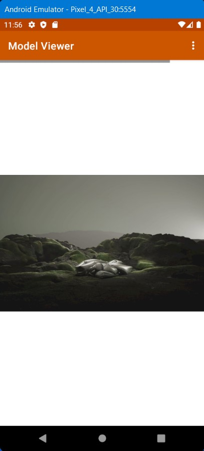
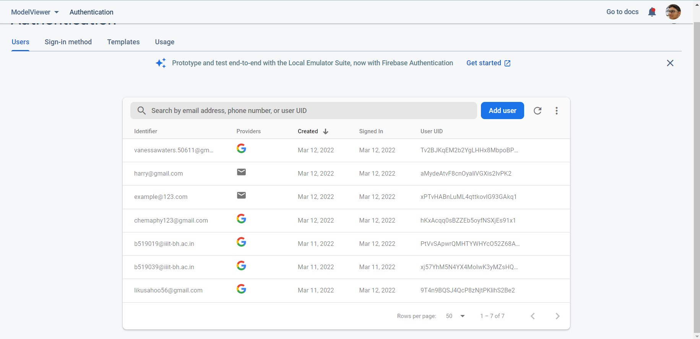

# 3D Model Presenting in Android
> This is an android app to present any 3D model with .glb or .glTF extension by using one of 2 easy ways.

Aim of this project is to demonstrate how to use, and present 3D models in an android app. The main, and suggested way to do that is using model viewer which is also used as the name of the project. However, there is still a good solution which is using ARCore, and it's implementation is also included in this project.

## Screenshots

>
  
  
  
  
  
  

## Documentation
1 - Model-Viewer: Model-Viewer is a web based solution where we simply load a html code into a web view. Model-viewer's own documantation is a great
source to find out what you can do more. Especially check out the attributes you can give to a model, and how it will create what you are looking 
for. Link -> [model-viewer][model-viewer]

2 - ARCore: ARCore which is also known as Google Play Services for AR Link is developed by Google and used to create augmented reality applications. Even
though augmented reality is not used in this project, you can still use ARCore for simply presenting your 3D models. Though, in case you need to present
your models in an augmented reality ARCore allows you to do so which makes it a more suitable solution than using model-viewer in that case. Link -> [ARCore][ARCore]

## Video Demo Link : https://vimeo.com/687237976

## APK Download Link : <a href="https://drive.google.com/file/d/1j_X1tkP_2kIovB0o7xRlzj4_54lb74H2/view?usp=sharing">Download</a>

